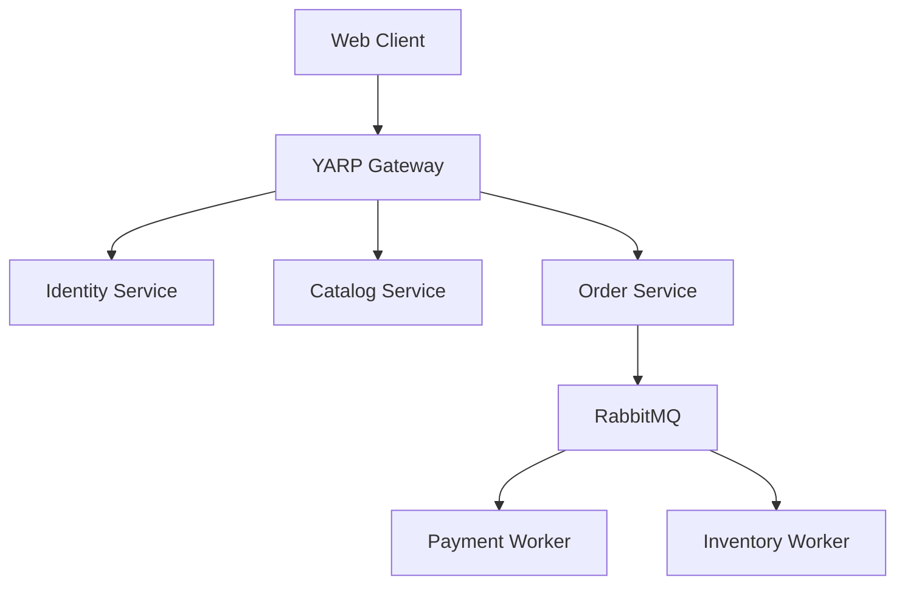

# 📘 Day 99: Documentation (Swagger/Architecture)

## 🎯 Mục tiêu ngày hôm nay

**Problem**: Code xong 3 tháng sau quên sạch. Team khác vào không hiểu Architecture.
**Solution**: **Document**. "Code tells you How, Comments tell you Why, Docs tell you What".

**Thời gian ước tính**: 60 phút.

---

## ✅ Checklist

- [ ] Polish Swagger UI (Descriptions, Examples).
- [ ] Draw C4 Model Diagram (Architecture).
- [ ] Update README.md.

---

## 📋 Hướng dẫn chi tiết từng bước

### Bước 1: Swagger Polish (30 phút)

Mặc định Swagger chỉ hiện tên API. Hãy thêm mô tả.
`Program.cs`:

```csharp
builder.Services.AddSwaggerGen(c =>
{
    c.SwaggerDoc("v1", new OpenApiInfo
    {
        Title = "Progcoder Catalog API",
        Version = "v1",
        Description = "API quản lý sản phẩm cho E-commerce System."
    });

    // Enable XML Comments (Cần bật trong .csproj)
    // var xmlFile = $"{Assembly.GetExecutingAssembly().GetName().Name}.xml";
    // var xmlPath = Path.Combine(AppContext.BaseDirectory, xmlFile);
    // c.IncludeXmlComments(xmlPath);
});
```

Thêm attribute vào Endpoint/Controller:

```csharp
/// <summary>
/// Lấy danh sách sản phẩm có phân trang.
/// </summary>
[HttpGet]
[ProducesResponseType(typeof(List<ProductDto>), 200)]
public async Task<IActionResult> GetProducts(...) { ... }
```

### Bước 2: Architecture Diagram (30 phút)

Vẽ sơ đồ luồng chính (Saga Flow) hoặc High Level Architecture.
Dùng **MermaidJS** ngay trong `README.md`.

Example `README.md`:



---

**Chúc bạn hoàn thành tốt Day 99!**
