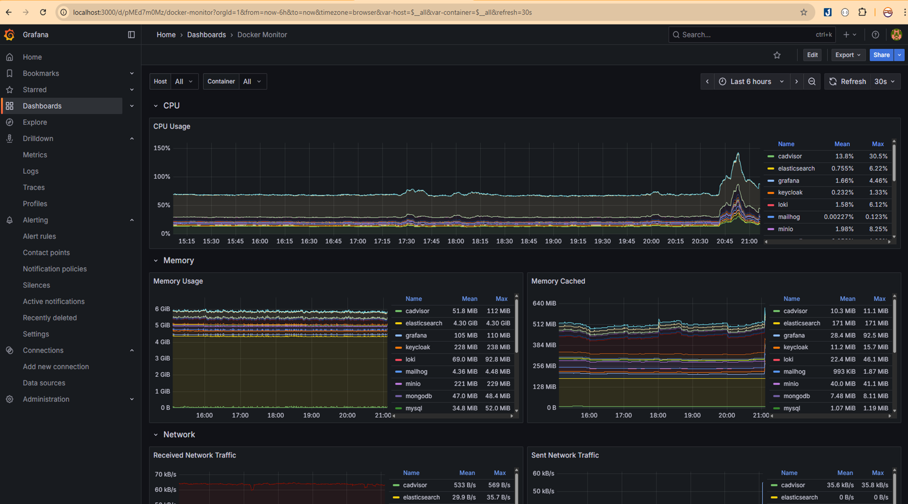

# ProG Coder Shop Microservices - E-Commerce Platform

**Real-world .NET Microservices Architecture**

Clean Architecture • DDD • CQRS • Event-Driven • Docker • Kubernetes • GitHub Actions

Created by [**ProG Coder**](https://www.progcoder.com)

[**🎥 Quick Demo**](https://youtu.be/snSgH7385tA) • [**💝 Support the Project**](DONATE.md) • [**⭐ Give a Star**](https://github.com/huynxtb/progcoder-shop-microservices) • [**📺 Watch Tutorials**](https://www.youtube.com/playlist?list=PLIbiRai7ofZ1M-ijpIhXST3ZvxEIAJcBr) • [**💬 Facebook Group**](https://www.facebook.com/groups/progcoder)

> *If you find this project useful, please **star the repository** to help us reach more developers!*

---

## 📋 Table of Contents

- [Project Overview](#-project-overview)
  - [Architecture Diagram](#architecture-diagram)
- [Technology Stack, Design Patterns, Infrastructure & Architecture](#technology-stack-design-patterns-infrastructure--architecture)
  - [Infrastructure](#infrastructure)
  - [Back-end [src/Services]](#back-end-srcservices)
  - [Front-end [src/Apps]](#front-end-srcapps)
  - [Design Patterns](#design-patterns)
  - [Architecture](#architecture)
- [Microservices Overview](#microservices-overview)
- [Infrastructure Services](#infrastructure-services)
- [Web Applications](#web-applications)
- [Web UI Screenshots](#web-ui-screenshots)
- [Project Structure](#project-structure)
- [Architecture & Design Patterns](#architecture--design-patterns)
  - [Clean Architecture](#clean-architecture)
  - [Domain-Driven Design (DDD)](#domain-driven-design-ddd)
  - [CQRS](#cqrs-command-query-responsibility-segregation)
  - [Event-Driven Architecture](#event-driven-architecture)
  - [Saga Pattern](#saga-pattern)
- [CI/CD Pipeline](#cicd-pipeline)
- [Observability & Monitoring](#observability--monitoring)
- [Data Infrastructure](#data-infrastructure)
- [Getting Started](#getting-started)
  - [Prerequisites](#prerequisites)
  - [Environment Configuration](#environment-configuration)
  - [Quick Start](#quick-start-productiontesting-mode)
  - [Development Mode](#development-mode)
  - [Access URLs](#access-urls)
  - [Default Credentials](#default-credentials)
- [API Gateway Routes](#api-gateway-routes)
- [Development](#development)
  - [Running Individual Services](#running-individual-services)
  - [Running Tests](#running-tests)
  - [Database Migrations](#database-migrations)
  - [Building Docker Images](#building-docker-images)
- [Troubleshooting](#troubleshooting)
- [Contributing](#contributing)
- [License](#license)

---

https://github.com/huynxtb/progcoder-shop-microservices/tree/main
## 🚀 Project Overview

This repository contains a comprehensive suite of microservices implementing a complete **e-commerce platform**, including **Catalog, Basket, Order, Inventory, Discount, Notification, Search, Report, and Communication** services. The platform utilizes a hybrid database strategy with **NoSQL (MongoDB, Redis)** and **Relational databases (PostgreSQL, SQL Server, MySQL)**.

Services communicate asynchronously via **RabbitMQ** (Event-Driven Architecture) and are routed through a high-performance **YARP API Gateway**.

### Architecture Diagram

Overall picture of the **microservices implementation** in the **ProG Coder Shop** project:


## Technology Stack, Design Patterns, Infrastructure & Architecture

### Infrastructure

- **`Windows 11`** - The OS for developing and building this application.
- **[`WSL2 - Ubuntu OS`](https://docs.microsoft.com/en-us/windows/wsl/install-win10)** - The subsystem that helps to run the bash shell on Windows OS.
- **[`Docker for Desktop (Kubernetes enabled)`](https://www.docker.com/products/docker-desktop)** - The easiest tool to run Docker, Docker Swarm, and Kubernetes on Mac and Windows.
- **[`Kubernetes`](https://kubernetes.io) / [`AKS`](https://docs.microsoft.com/en-us/azure/aks)** - The app is designed to run on Kubernetes (both locally on "Docker for Desktop" as well as on the cloud with AKS).
- **[`GitHub Actions`](https://github.com/features/actions)** - CI/CD automation platform for building, testing, and deploying applications.
- **[`Helm`](https://helm.sh)** - ⚠️ **Under Development** - Package manager for Kubernetes applications.

### Back-end [src/Services]

- **[`.NET Core 8`](https://dotnet.microsoft.com/download)** - .NET Framework and .NET Core, including ASP.NET and ASP.NET Core.
- **[`Minimal API`](https://learn.microsoft.com/en-us/aspnet/core/fundamentals/minimal-apis)** - Architected to create HTTP APIs with minimal dependencies.
- **[`Keycloak`](https://www.keycloak.org)** - Open-source Identity and Access Management solution.
- **[`YARP`](https://github.com/microsoft/reverse-proxy)** - A toolkit for developing high-performance HTTP reverse proxy applications.
- **[`FluentValidation`](https://github.com/FluentValidation/FluentValidation)** - Popular .NET validation library for building strongly-typed validation rules.
- **[`MediatR`](https://github.com/jbogard/MediatR)** - Simple, unambitious mediator implementation in .NET.
- **[`EF Core`](https://github.com/dotnet/efcore)** - Modern object-database mapper for .NET. It supports LINQ queries, change tracking, updates, and schema migrations.
- **[`Scrutor`](https://github.com/khellang/Scrutor)** - Assembly scanning and decoration extensions for Microsoft.Extensions.DependencyInjection.
- **[`Serilog`](https://github.com/serilog/serilog)** - Simple .NET logging with fully-structured events.
- **[`Carter`](https://github.com/CarterCommunity/Carter)** - Carter is a library that allows Nancy-esque routing for use with ASP.NET Core.
- **[`Marten`](https://github.com/JasperFx/marten)** - Marten is a .NET document database and event store library.
- **[`AspNetCore.HealthChecks`](https://github.com/Xabaril/AspNetCore.Diagnostics.HealthChecks)** - Health checks for building services, such as ASP.NET Core.
- **[`Grpc.AspNetCore`](https://github.com/grpc/grpc-dotnet)** - gRPC for .NET, a high-performance RPC framework.
- **[`MassTransit.RabbitMQ`](https://github.com/MassTransit/MassTransit)** - Distributed application framework for .NET, supporting RabbitMQ.
- **[`AutoMapper`](https://github.com/LuckyPennySoftware/AutoMapper)** - A high-performance object mapper in .NET.
- **[`MongoDB.Driver`](https://github.com/mongodb/mongo-csharp-driver)** - Official MongoDB .NET Driver.
- **[`Minio`](https://github.com/minio/minio-dotnet)** - MinIO .NET Client SDK for Amazon S3 compatible cloud storage.
- **[`StackExchangeRedis`](https://github.com/StackExchange/StackExchange.Redis)** - General purpose Redis client for .NET.
- **[`Polly`](https://github.com/App-vNext/Polly)** - Polly is a .NET resilience and transient-fault-handling library.
- **[`OpenTelemetry`](https://opentelemetry.io)** - OpenTelemetry provides observability frameworks for cloud-native software.
- **[`Quartz.NET`](https://www.quartz-scheduler.net)** - Job scheduling library for .NET.
- **[`NEST`](https://github.com/elastic/elasticsearch-net)** - Official Elasticsearch .NET client for full-text search and analytics.
- **[`Dapper`](https://github.com/DapperLib/Dapper)** - Micro-ORM for .NET.
- **[`SignalR`](https://dotnet.microsoft.com/apps/aspnet/signalr)** - Library for adding real-time web functionality to apps.
- **[`Refit`](https://github.com/reactiveui/refit)** - The automatic type-safe HTTP library for .NET Core.
- **[`Feature Management`](https://github.com/microsoft/FeatureManagement-Dotnet)** - Library for feature flags management in .NET.
- **[`FusionCache`](https://github.com/ZiggyCreatures/FusionCache)** - Easy to use, fast and robust hybrid cache with advanced features (Will be applied in User Service soon).

### Front-end [src/Apps]

- **[`Node.js 18.x`](https://nodejs.org/en/download)** - JavaScript runtime built on Chrome's V8 JavaScript engine.
- **[`ReactJS`](https://reactjs.org)** - A JavaScript library for building user interfaces.
- **[`Vite`](https://vitejs.dev)** - Next generation frontend tooling for fast development.
- **[`i18next`](https://www.i18next.com)** - Internationalization framework.
- **[`Keycloak-js`](https://www.keycloak.org/docs/latest/securing_apps/#_javascript_adapter)** - JavaScript adapter for Keycloak.
- **[`Redux Toolkit`](https://redux-toolkit.js.org)** - The official, opinionated, batteries-included toolset for efficient Redux development.
- **[`Axios`](https://axios-http.com)** - Promise based HTTP client for the browser and node.js.
- **[`React Hook Form`](https://react-hook-form.com)** - Performant, flexible and extensible forms.
- **[`Formik`](https://formik.org)** - Build forms in React, without the tears.
- **[`Yup`](https://github.com/jquense/yup)** - Schema builder for value parsing and validation.
- **[`Material UI`](https://mui.com)** - Move faster with intuitive React UI tools.
- **[`ApexCharts`](https://apexcharts.com)** - Modern & Interactive Open-source Charts.
- **[`Chart.js`](https://www.chartjs.org)** - Simple yet flexible JavaScript charting for designers & developers.

### Design Patterns

- **Repository** - Abstracts data access logic, providing a collection-like interface for domain objects.
- **Unit of Work** - Maintains a list of objects affected by a business transaction and coordinates changes.
- **Decorator** - A structural pattern that allows behavior to be added to individual objects dynamically.
- **Strategy** - A behavioral pattern that enables selecting an algorithm's behavior at runtime.
- **Mediator** - Reduces coupling between components by centralizing complex communications and control logic (using MediatR).
- **CQRS** - Command Query Responsibility Segregation, a pattern that separates read and write operations.
- **Saga** - A pattern for managing failures, ensuring data consistency across microservices.
- **Outbox Pattern** - Ensures reliable event publishing in distributed systems.
- **Inbox Pattern** - Ensures idempotent message processing, preventing duplicate event handling.
- **Vertical Slice Architecture** - Organizes code by features instead of technical layers.

### Architecture

This project implements modern architectural patterns to ensure scalability, maintainability, and testability.

#### 1. Clean Architecture

Most services follow **Clean Architecture** combined with **DDD (Domain-Driven Design)** and **CQRS (Command Query Responsibility Segregation)**. This separation of concerns allows for independent evolution of the domain logic and infrastructure.


#### 2. Vertical Slice Architecture

To minimize complexity and coupling in specific features or smaller services, we utilize **Vertical Slice Architecture**. Instead of separating by technical layers (Controller, Service, Repository), code is organized by **Features** (e.g., "AddItemToBasket", "Checkout"). Each slice contains all the logic needed to fulfill a request, from API to Database.


## Microservices Overview

| Service | Port (HTTPS) | gRPC Port | Database | Description |
|---------|-------------|-----------|----------|-------------|
| **Catalog Service** | 5001 | 6001 | PostgreSQL (5433) | Product catalog management, categories, brands |
| **Basket Service** | 5006 | - | MongoDB (27018) + Redis (6380) | Shopping cart and session management |
| **Order Service** | 5005 | 6005 | SQL Server (1434) | Order processing and management |
| **Inventory Service** | 5002 | 6002 | MySQL (3307) | Stock and inventory management |
| **Discount Service** | 5004 | 6004 | PostgreSQL (5433) | Coupons, promotions, and discount rules |
| **Notification Service** | 5003 | 6003 | PostgreSQL (5433) | Email/SMS notifications |
| **Report Service** | 5007 | 6007 | PostgreSQL (5433) | Analytics, dashboards, and reporting |
| **Search Service** | 5008 | - | Elasticsearch (9200) | Full-text product search |
| **Communication Service** | 5009 | - | PostgreSQL (5433) | Webhooks and external integrations |

## Infrastructure Services

| Component | Port(s) | Purpose | Access URL | Default Credentials |
|-----------|---------|---------|------------|-------------------|
| **PostgreSQL** | 5433 | Relational database for multiple services | `localhost:5433` | postgres / 123456789Aa |
| **MongoDB** | 27018 | Document database for Basket service | `localhost:27018` | mongodb / 123456789Aa |
| **MySQL** | 3307 | Relational database for Inventory | `localhost:3307` | root / 123456789Aa |
| **SQL Server** | 1434 | Relational database for Order service | `localhost:1434` | sa / 123456789Aa |
| **Redis** | 6380 | Cache and session storage | `localhost:6380` | Password: 123456789Aa |
| **RabbitMQ** | 5673, 15673 | Message broker for event-driven communication | http://localhost:15673 | admin / 123456789Aa |
| **Keycloak** | 8080 | Identity and Access Management | http://localhost:8080 | admin / admin |
| **MinIO** | 9000, 9001 | S3-compatible object storage | http://localhost:9001 | minioadmin / minioadmin |
| **Elasticsearch** | 9200 | Search engine and analytics | http://localhost:9200 | elastic / elastic123 |
| **Prometheus** | 9090 | Metrics collection and monitoring | http://localhost:9090 | - |
| **Grafana** | 3000 | Metrics visualization and dashboards | http://localhost:3000 | admin / admin |
| **Tempo** | 3200 | Distributed tracing backend | http://localhost:3200 | - |
| **Loki** | 3100 | Log aggregation system | http://localhost:3100 | - |
| **Promtail** | 1514, 9080 | Log collection agent | - | - |
| **OpenTelemetry Collector** | 4317, 8888 | Telemetry data collection | http://localhost:8888 | - |
| **Portainer** | 9000, 9443 | Container management UI | http://localhost:9443 | admin / (set on first run) |
| **MailHog** | 1025, 8025 | Email testing tool | http://localhost:8025 | - |
| **cAdvisor** | - | Container metrics | - | - |

## Web Applications

| Application | Port | Technology Stack | Purpose | Access URL |
|-------------|------|------------------|---------|------------|
| **App.Admin** | 3001 | React + Vite + TailwindCSS | Admin management interface | http://localhost:3001 |
| **Store Frontend** | 3002 | React + Vite + Bootstrap | Customer shopping interface | http://localhost:3002 |
| **YARP API Gateway** | 15009 | ASP.NET Core + YARP | API Gateway and reverse proxy | http://localhost:15009 |

## Web UI Screenshots

### App.Admin


### App.Store


All screenshots are stored in [assets/imgs/screenshots](assets/imgs/screenshots).

## Project Structure

```
progcoder-shop-microservices/
├── src/
│   ├── Services/                    # Backend Microservices
│   │   ├── Basket/                  # Shopping cart service
│   │   │   ├── Api/                 # REST API endpoints
│   │   │   ├── Core/                # Domain, Application layers
│   │   │   └── Worker/              # Background workers (Outbox)
│   │   ├── Catalog/                 # Product catalog service
│   │   │   ├── Api/                 # REST API + gRPC
│   │   │   ├── Core/                # Domain, Application layers
│   │   │   └── Worker/              # Background workers (Outbox, Consumer)
│   │   ├── Communication/           # Webhooks and messaging
│   │   ├── Discount/                # Coupons and promotions
│   │   ├── Inventory/               # Stock management
│   │   ├── Notification/            # Email/SMS notifications
│   │   ├── Order/                   # Order processing
│   │   ├── Report/                  # Analytics and reporting
│   │   └── Search/                  # Product search (Elasticsearch)
│   ├── Apps/
│   │   ├── App.Admin/               # App.Admin (React)
│   │   └── App.Store/               # E-commerce storefront (React)
│   ├── ApiGateway/
│   │   └── YarpApiGateway/          # YARP reverse proxy
│   ├── JobOrchestrator/
│   │   └── App.Job/                 # Scheduled background jobs (Quartz)
│   └── Shared/
│       ├── BuildingBlocks/          # CQRS, Behaviors, Pagination
│       ├── Common/                  # Extensions, Helpers, Models
│       ├── Contracts/               # gRPC proto definitions
│       └── EventSourcing/           # Integration events
├── config/                          # Configuration files
│   ├── prometheus/                  # Prometheus config and alert rules
│   ├── grafana/                     # Grafana dashboards and datasources
│   ├── loki/                        # Loki configuration
│   ├── tempo/                       # Tempo configuration
│   ├── otel-collector/              # OpenTelemetry Collector config
│   ├── keycloak/                    # Keycloak providers
│   └── rabbitmq/                    # RabbitMQ plugins
├── assets/                          # Static assets
│   ├── imgs/                        # Architecture diagrams and screenshots
│   └── postman collections/         # API testing collections
├── local-data/                      # Persistent data volumes
├── docker-compose.infrastructure.yml           # Infrastructure services
├── docker-compose.yml               # Application services
└── README.md                        # This file
```

## Architecture & Design Patterns

### Clean Architecture

The project follows Clean Architecture principles with clear separation of concerns:

- **Domain Layer**: Contains business entities, value objects, domain events, and business rules. No dependencies on other layers.
- **Application Layer**: Contains business logic, CQRS commands/queries, DTOs, and interfaces. Depends only on Domain layer.
- **Infrastructure Layer**: Contains data access, external service integrations, and infrastructure concerns. Implements interfaces from Application layer.
- **API Layer**: Contains REST API endpoints using Carter, request/response models, and API routing.

### Domain-Driven Design (DDD)

- **Aggregates**: Root entities that maintain consistency boundaries
- **Value Objects**: Immutable objects representing domain concepts
- **Domain Events**: Events raised within the domain to communicate state changes
- **Repositories**: Abstraction for data access with interface in Application and implementation in Infrastructure

### CQRS (Command Query Responsibility Segregation)

- **Commands**: Write operations that modify state (using MediatR)
- **Queries**: Read operations that return data without side effects
- **Handlers**: Separate handlers for commands and queries
- **Validators**: FluentValidation for command/query validation

### Event-Driven Architecture

- **Domain Events**: Internal events within a service
- **Integration Events**: Cross-service communication via RabbitMQ
- **Outbox Pattern**: Ensures reliable event publishing using outbox tables
- **Event Handlers**: MassTransit consumers for processing integration events

### Saga Pattern

Distributed transaction management across multiple services using choreography-based sagas with event-driven coordination.

## CI/CD Pipeline

The project uses **GitHub Actions** for continuous integration and deployment:

- **Build Workflow**: Automated building and testing of services
- **Docker Image Publishing**: Automated image building and pushing to Docker Hub
- **Multi-service Deployment**: Coordinated deployment across all microservices
- **Kubernetes Deployment**: ⚠️ **Under Development**


## Observability & Monitoring

### Distributed Tracing

- **OpenTelemetry**: Instrumentation for all services
- **Tempo**: Distributed tracing backend
- **Jaeger Protocol**: Trace visualization and analysis

### Metrics & Monitoring



- **Prometheus**: Collects metrics from all services, databases, and message brokers.
- **Grafana**: Provides beautiful, pre-configured dashboards for real-time monitoring:
  - **Service Health**: CPU, Memory, Request latency, and Error rates.
  - **Infrastructure**: Docker container stats (via cAdvisor) and System resources.
  - **Business Metrics**: Real-time order stats, revenue, and active users.
- **cAdvisor**: Container resource usage metrics.
- **ASP.NET Core Health Checks**: Exposes health status for Kubernetes probes.

### Centralized Logging


- **Loki**: Horizontally-scalable, highly-available, multi-tenant log aggregation system.
- **Promtail**: The agent which ships the contents of local logs to a private Grafana Loki instance.
- **Grafana**: Allows you to query logs using LogQL and correlate them with metrics and traces.
- **Serilog**: Structured logging in all services, ensuring logs are rich with context (TraceId, SpanId) for distributed tracing correlation.

### Alerting

- **Prometheus Alertmanager**: Alert routing and management
- Configured alerts for:
  - Service downtime
  - High error rates
  - Database connection failures
  - Message queue backlogs

## Data Infrastructure

### MinIO
- Object storage solution designed for high performance and scalability
- Stores product images, documents, and other unstructured data
- S3-compatible API for easy integration

### Elasticsearch
- Full-text search engine for product catalog
- Powered by Search Service for fast product discovery
- Supports fuzzy search, filters, and faceted navigation

### Redis
- In-memory cache for session management
- Shopping cart persistence
- Distributed caching for frequently accessed data

### Message Broker (RabbitMQ)
- Event-driven communication between services
- Reliable message delivery with acknowledgments
- Dead-letter queues for failed messages
- Message persistence for durability

## Getting Started

### Prerequisites

Before running the project, ensure you have the following installed:

- **Docker Desktop** (with Kubernetes enabled) - [Download](https://www.docker.com/products/docker-desktop)
- **.NET 8 SDK** - [Download](https://dotnet.microsoft.com/download/dotnet/8.0)
- **Node.js 18+** - [Download](https://nodejs.org/)
- **Git** - [Download](https://git-scm.com/)

### Environment Configuration

1. **Create environment file** (Infrastructure uses environment variables):

```bash
# Copy the example environment file
cp .env.example .env

# Edit .env and configure your custom ports and credentials if needed
```

**Note**: The `.env.example` file contains all required environment variables with default values. Key configurations include:
- Database ports (custom ports to avoid conflicts: PostgreSQL 5433, MongoDB 27018, MySQL 3307, SQL Server 1434)
- Database credentials
- Message broker settings (RabbitMQ on ports 5673/15673)
- Identity provider (Keycloak on port 8080)
- Monitoring stack ports
- Object storage (MinIO on ports 9000/9001)

### Quick Start (Production/Testing Mode)

**Run the entire system with Docker Compose** - Best for testing and production deployment:

```bash
# Clone the repository
git clone <repository-url>
cd progcoder-shop-microservices

# Copy and configure environment variables
cp .env.example .env

# Option 1: Build all images in parallel, then start services
docker-compose build --parallel
docker-compose up -d

# Option 2: Build and start services in one command
docker-compose up --build -d

# Check all services are running
docker-compose ps

# View logs
docker-compose logs -f

# View logs for specific service
docker-compose logs -f [service-name]

# Stop all services
docker-compose down

# Stop and remove volumes (clean slate)
docker-compose down -v

# Restart all services
docker-compose restart

# Rebuild and restart all services
docker-compose up --build -d --force-recreate
```

After starting, access:
- **App.Admin**: http://localhost:3001
- **App.Store**: http://localhost:3002
- **API Gateway**: http://localhost:15009
- **Keycloak**: http://localhost:8080
- **Grafana**: http://localhost:3000
- **RabbitMQ Management**: http://localhost:15673

### Development Mode

**For development**, run services individually to debug and modify code:

#### 1. Start Infrastructure Services Only

```bash
# Start infrastructure services (databases, message broker, monitoring, etc.)
docker-compose -f docker-compose.infrastructure.yml up -d

# Wait for all services to be healthy (check with)
docker-compose -f docker-compose.infrastructure.yml ps

# View logs if needed
docker-compose -f docker-compose.infrastructure.yml logs -f [service-name]
```

#### 2. Setup Databases

**Option A: Apply Existing Migrations (Recommended for first-time setup)**

Use this to apply all existing migrations to your databases without creating new ones:

```bash
# On Linux/Mac/WSL
chmod +x run-migration-linux.sh
./run-migration-linux.sh

# On Windows (PowerShell/CMD)
run-migration-windows.bat
```

This script will automatically:
- Install dotnet-ef tool if needed
- Apply all pending migrations for Inventory service (MySQL)
- Apply all pending migrations for Order service (SQL Server)
- Show a summary of results

**Option B: Create New Migrations (For developers making schema changes)**

Use this when you need to create a new migration after modifying entities:

```bash
# On Linux/Mac/WSL
chmod +x add-migration-linux.sh
./add-migration-linux.sh

# On Windows (PowerShell/CMD)
add-migration-windows.bat
```

This script will:
- Prompt you to select a service
- Ask for a migration name
- Create the migration
- Automatically apply it to the database

#### 3. Configure Keycloak

1. Open Keycloak Admin Console: http://localhost:8080
2. Login with: `admin` / `admin`
3. Create realm: `prog-coder-realm`
4. Create client: `prog-coder-client-id`
5. Configure client settings and obtain client secret
6. Update `appsettings.json` in each service with Keycloak settings

#### 4. Start Backend Services

Each service can be started individually. Open separate terminal windows:

```bash
# Catalog Service
cd src/Services/Catalog/Api/Catalog.Api
dotnet run

# Basket Service
cd src/Services/Basket/Api/Basket.Api
dotnet run

# Order Service
cd src/Services/Order/Api/Order.Api
dotnet run

# Inventory Service
cd src/Services/Inventory/Api/Inventory.Api
dotnet run

# Discount Service
cd src/Services/Discount/Api/Discount.Api
dotnet run

# Notification Service
cd src/Services/Notification/Api/Notification.Api
dotnet run

# Report Service
cd src/Services/Report/Api/Report.Api
dotnet run

# Search Service
cd src/Services/Search/Api/Search.Api
dotnet run

# Communication Service
cd src/Services/Communication/Api/Communication.Api
dotnet run

# API Gateway
cd src/ApiGateway/YarpApiGateway
dotnet run
```

#### 5. Start Worker Services (Background Jobs)

```bash
# Catalog Outbox Worker
cd src/Services/Catalog/Worker/Catalog.Worker.Outbox
dotnet run

# Basket Outbox Worker
cd src/Services/Basket/Worker/Basket.Worker.Outbox
dotnet run

# Order Outbox Worker
cd src/Services/Order/Worker/Order.Worker.Outbox
dotnet run

# Inventory Outbox Worker
cd src/Services/Inventory/Worker/Inventory.Worker.Outbox
dotnet run

# Notification Consumer Worker
cd src/Services/Notification/Worker/Notification.Worker.Consumer
dotnet run

# Search Consumer Worker
cd src/Services/Search/Worker/Search.Worker.Consumer
dotnet run
```

#### 6. Start Frontend Applications

```bash
# App Admin
cd src/Apps/App.Admin
npm install
npm run dev
# Access at: http://localhost:3001

# App Store
cd src/Apps/App.Store
npm install
npm run dev
# Access at: http://localhost:3002
```

#### 7. Start Job Orchestrator (Optional)

```bash
cd src/JobOrchestrator/App.Job
dotnet run
```

### Access URLs

After starting all services, you can access:

#### Frontend Applications
- **App.Admin**: http://localhost:3001
- **App.Store**: http://localhost:3002
- **API Gateway**: http://localhost:15009

#### Backend Services (Swagger)
- **Catalog API**: http://localhost:5001/swagger
- **Basket API**: http://localhost:5006/swagger
- **Order API**: http://localhost:5005/swagger
- **Inventory API**: http://localhost:5002/swagger
- **Discount API**: http://localhost:5004/swagger
- **Notification API**: http://localhost:5003/swagger
- **Report API**: http://localhost:5007/swagger
- **Search API**: http://localhost:5008/swagger
- **Communication API**: http://localhost:5009/swagger

#### Infrastructure & Monitoring
- **Keycloak**: http://localhost:8080 (admin / admin)
- **RabbitMQ Management**: http://localhost:15673 (admin / 123456789Aa)
- **MinIO Console**: http://localhost:9001 (minioadmin / minioadmin)
- **Grafana**: http://localhost:3000 (admin / admin)
- **Prometheus**: http://localhost:9090
- **Portainer**: http://localhost:9443
- **MailHog**: http://localhost:8025
- **Elasticsearch**: http://localhost:9200 (elastic / elastic123)

### Default Credentials

| Service | Username | Password |
|---------|----------|----------|
| Keycloak | admin | admin |
| Grafana | admin | admin |
| RabbitMQ | admin | 123456789Aa |
| PostgreSQL | postgres | 123456789Aa |
| MongoDB | mongodb | 123456789Aa |
| MySQL | root | 123456789Aa |
| SQL Server | sa | 123456789Aa |
| MinIO | minioadmin | minioadmin |
| Elasticsearch | elastic | elastic123 |
| Redis | - | 123456789Aa |

## API Gateway Routes

The YARP API Gateway provides unified access to all microservices:

| Route | Target Service | Example |
|-------|---------------|---------|
| `/catalog-service/**` | Catalog Service (5001) | `/catalog-service/api/products` |
| `/basket-service/**` | Basket Service (5006) | `/basket-service/api/baskets` |
| `/order-service/**` | Order Service (5005) | `/order-service/api/orders` |
| `/inventory-service/**` | Inventory Service (5002) | `/inventory-service/api/inventory` |
| `/discount-service/**` | Discount Service (5004) | `/discount-service/api/coupons` |
| `/notification-service/**` | Notification Service (5003) | `/notification-service/api/notifications` |
| `/report-service/**` | Report Service (5007) | `/report-service/api/reports` |
| `/search-service/**` | Search Service (5008) | `/search-service/api/search` |
| `/communication-service/**` | Communication Service (5009) | `/communication-service/api/webhooks` |

## Development

### Running Individual Services

You can run services individually for development:

```bash
cd src/Services/[ServiceName]/Api/[ServiceName].Api
dotnet watch run
```

### Running Tests

```bash
# Run all tests
dotnet test

# Run tests for a specific service
cd src/Services/[ServiceName]/Tests
dotnet test
```

### Database Migrations

```bash
# Add migration
cd src/Services/[ServiceName]/Infrastructure
dotnet ef migrations add [MigrationName] -s ../Api/[ServiceName].Api

# Apply migration
dotnet ef database update -s ../Api/[ServiceName].Api
```

### Building Docker Images

#### Method 1: Build Incrementally by Service Groups (Recommended)

This approach helps avoid Docker daemon overload and makes debugging easier:

```bash
# Step 1: Start infrastructure services first
docker-compose up -d redis postgres-sql mysql mongodb sql-server elasticsearch rabbitmq minio keycloak otel-collector

# Step 2: Build and run gRPC services
docker-compose up --build -d catalog-grpc inventory-grpc order-grpc discount-grpc report-grpc

# Step 3: Build and run API services
docker-compose up --build -d catalog-api basket-api inventory-api order-api discount-api notification-api search-api report-api communication-api

# Step 4: Build and run Workers
docker-compose up --build -d basket-worker-outbox catalog-woker-outbox catalog-worker-consumer inventory-worker-outbox inventory-worker-consumer order-woker-outbox order-worker-consumer search-worker-consumer notification-worker-consumer notification-worker-processor

# Step 5: Build and run API Gateway and Apps
docker-compose up --build -d api-gateway app-admin app-store app-job
```

#### Method 2: Build All Services at Once (For Powerful Machines)

This method is faster but requires sufficient system resources:

```bash
# Build all images in parallel
docker-compose build --parallel

# Start all services
docker-compose up -d

# Or combine both steps
docker-compose up --build -d
```

#### Method 3: Build Specific Services

```bash
# Build specific service
docker-compose build [service-name]

# Build and start specific service
docker-compose up --build -d [service-name]
```

#### Rebuild Images and Start Services

```bash
# Force rebuild all images without cache
docker-compose build --no-cache --parallel

# Rebuild and restart all services
docker-compose up --build -d --force-recreate
```

## Troubleshooting

### Common Issues

1. **Port Conflicts**: Ensure no other services are using the configured ports
   - Check with: `netstat -ano | findstr :[PORT]` (Windows) or `lsof -i :[PORT]` (Mac/Linux)

2. **Database Connection Errors**: 
   - Verify all database containers are running: `docker ps`
   - Check database logs: `docker logs [container-name]`

3. **Keycloak Configuration**:
   - Ensure realm and client are properly configured
   - Verify client secret matches in service configurations

4. **RabbitMQ Connection Issues**:
   - Check RabbitMQ is running: http://localhost:15673
   - Verify credentials in service configurations

5. **Docker Build Timeout or DNS Errors**:
   - If you see `i/o timeout` or `failed to do request`, it's likely a Docker daemon network issue
   - **Solution 1**: Restart Docker Desktop
   - **Solution 2**: Check Docker Desktop proxy settings (Settings → Resources → Proxies)
   - **Solution 3**: Clean up Docker cache: `docker system prune -af`
   - **Solution 4**: Build services incrementally (see Method 1 in Building Docker Images section)

6. **Docker Build Context Too Large**:
   - Ensure `.dockerignore` file exists and excludes unnecessary files
   - The `.dockerignore` should exclude: `docker-volumes/`, `config/`, `assets/`, `node_modules`, `*.log`, `*.sock`

7. **Worker Services Failing to Start**:
   - Error: `Framework 'Microsoft.AspNetCore.App' not found`
   - **Solution**: Ensure all worker Dockerfiles use `mcr.microsoft.com/dotnet/aspnet:8.0` (not `runtime:8.0`)

### Useful Commands

```bash
# Check container status
docker-compose ps

# View logs for all services
docker-compose logs -f

# View logs for specific service
docker-compose logs -f [service-name]

# Restart a service
docker-compose restart [service-name]

# Stop all services
docker-compose down

# Stop all services and remove volumes (clean slate)
docker-compose down -v

# Remove stopped containers and unused images
docker system prune -f

# Remove all unused images, containers, networks, and volumes
docker system prune -af --volumes

# Check Docker disk usage
docker system df

# View running containers
docker ps

# View all containers (including stopped)
docker ps -a

# Execute command in running container
docker exec -it [container-name] bash

# Check container resource usage
docker stats
```

### Infrastructure Services Only Commands

```bash
# Check container status
docker-compose -f docker-compose.infrastructure.yml ps

# View logs
docker-compose -f docker-compose.infrastructure.yml logs -f [service-name]

# Restart a service
docker-compose -f docker-compose.infrastructure.yml restart [service-name]

# Stop all services
docker-compose -f docker-compose.infrastructure.yml down

# Remove volumes (clean slate)
docker-compose -f docker-compose.infrastructure.yml down -v
```

## Contributing

We welcome community contributions! We use GitHub issues to track bugs and feature requests, and pull requests to manage contributions. See the [contribution information](CONTRIBUTING.md) for more details.

## License

Code released under [the MIT License](LICENSE)

## Authors

- **Huy Nguyen** - *Initial work* - [huynxtb](https://github.com/huynxtb)

See also the list of [contributors](https://github.com/huynxtb/progcoder-shop-microservices/contributors) who participated in this project.

## Community

Join our community to stay updated and connect with other developers:

- 💬 **Facebook Group**: [ProG Coder Community](https://www.facebook.com/groups/progcoder) - Get the latest updates, ask questions, and share your experience
- 📺 **YouTube Channel**: [ProG Coder](https://www.youtube.com/@prog-coder) - Video tutorials and coding sessions
- 🌐 **Website**: [https://www.progcoder.com](https://www.progcoder.com) - Articles, resources, and more

## Additional Resources

- **Postman Collection**: See `assets/postman collections/` for API testing
- **Architecture Diagrams**: See `assets/imgs/` for visual references

